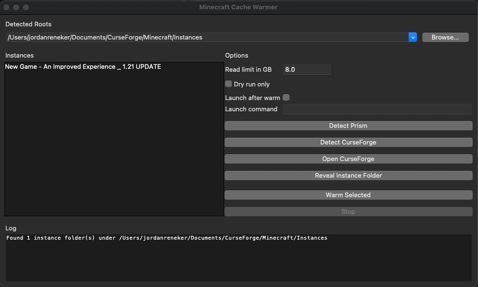

<p align="center">
  
</p>

**Motivation**
* This was a requested utility tool created to improve load times for Minecraft installations with substantial mod collections

# Minecraft Cache Warmer

Warm the operating system file cache for modded Minecraft so repeat starts feel faster. The GUI finds CurseForge and Prism instances, warms selected packs, shows progress, and can open Prism after the warm.

## Features
* Auto discovery of common CurseForge and Prism instance folders on Windows and macOS  
* Warm selected instances by reading jars, zips, assets, and configs to prime the OS page cache  
* Progress bar and live log  
* Dry run mode that lists planned reads  
* Optional launch of Prism after warm using a command template with `{instance}`  
* Buttons to detect CurseForge, open CurseForge, and reveal the selected instance folder

## Quick start

### Windows
1. Install Python 3 if needed  
2. Open PowerShell in the repo folder  
3. Run
powershell
```
python minecraft_gui.py
```

### MacOS
```
/opt/homebrew/bin/python3.12 minecraft_gui.py
```

### Why this helps

Operating systems keep recently read data in memory.  
By reading mod jars, assets, and config files in advance, the next game start avoids many disk seeks.  
Later starts feel closer to a warm start even after a reboot.


### Result table

<table>
  <thead>
    <tr>
      <th>Machine</th>
      <th>Storage</th>
      <th>Instance size</th>
      <th>Java</th>
      <th>T0 to Menu cold</th>
      <th>T0 to Menu warm</th>
      <th>Delta</th>
      <th>Delta percent</th>
    </tr>
  </thead>
  <tbody>
    <tr>
      <td>Desktop 1</td>
      <td>NVMe</td>
      <td>8.2 GB mods</td>
      <td>Temurin 21</td>
      <td>90.0 s</td>
      <td>20.0 s</td>
      <td><strong>70.0 s</strong></td>
      <td><strong>77.8%</strong></td>
    </tr>
    <tr>
      <td>Laptop 1</td>
      <td>SATA SSD</td>
      <td>8.2 GB mods</td>
      <td>Temurin 21</td>
      <td>160.0 s</td>
      <td>40.0 s</td>
      <td><strong>120.0 s</strong></td>
      <td><strong>75.0%</strong></td>
    </tr>
  </tbody>
</table>


### FAQ

**Q:** Why do my results vary?  
**A:** JVM warmup, concurrent downloads, and background processes introduce variance. Use multiple trials and report medians.

**Q:** Does this help after I already launched once?  
**A:** Usually the second launch is already warm. The tool is useful after a reboot or when switching large packs.

**Q:** Does this reduce total memory for the game?  
**A:** The OS can evict cache pages under pressure. If you run low on RAM it will drop old cache before it starves the game.

