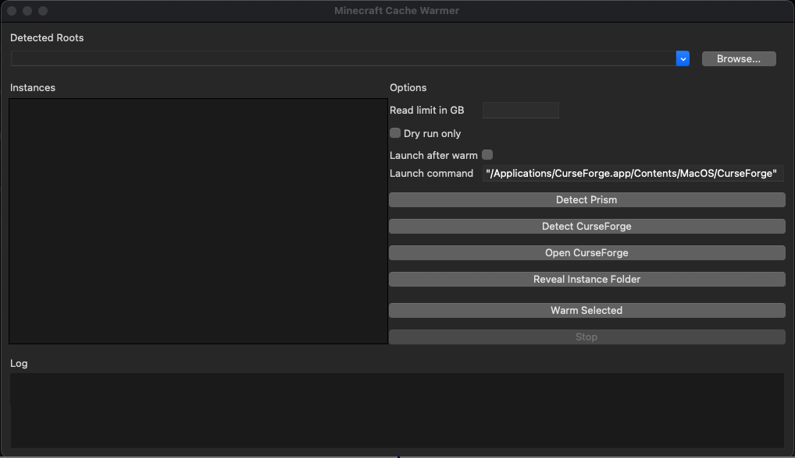

<p align="center">
  
</p>

**Motivation**
* I made this to help a friend load their game faster even with their massive minecraft modlist!!

# Minecraft Cache Warmer

Warm the operating system file cache for modded Minecraft so repeat starts feel faster. The GUI finds CurseForge and Prism instances, warms selected packs, shows progress, and can open Prism after the warm.

## Features
* Auto discovery of common CurseForge and Prism instance folders on Windows and macOS  
* Warm selected instances by reading jars, zips, assets, and configs to prime the OS page cache  
* Progress bar and live log  
* Dry run mode that lists planned reads  
* Optional launch of Prism after warm using a command template with `{instance}`  
* Buttons to detect CurseForge, open CurseForge, and reveal the selected instance folder

## Quick start

### Windows
1. Install Python 3 if needed  
2. Open PowerShell in the repo folder  
3. Run
powershell
   ```
   python minecraft_gui.py
   ```

### MacOS
```
/opt/homebrew/bin/python3.12 minecraft_gui.py
```

### Why this helps

* Operating systems keep recently read data in memory.
* By reading mod jars, assets, and config files in advance, the next game start avoids many disk seeks.
* Later starts feel closer to a warm start even after a reboot.

### Note

* After you change mods or resource packs, run the warm again.

